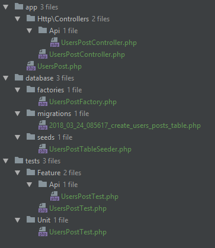

# Command shortcuts:

Theses are some cmd shortcuts for windows.

## Contents:

[Example](#example)  
[Installation](#installation)  
[Laravel Commands](#laravel)  
[Git Commands](#git)  
[Windows Commands](windows-commands)  


## Example
For example if you need to check the status of your git repo, you can type:
```
g
```
instead of:
```
git status
```

Support:
- Git
- Laravel
- windows: some common commands.

## Installation:
1 - download this repo to your local machine    
2 - open your Environment Variables  
3- add the path to this directory in Path variable. 

## Laravel:

php artisan serve + open in chrome browser:
```
l
```
php artisan migrate:refresh --seed
```
lm 
```
php artisan migrate:fresh --seed
```
lmf
```
php artisan route:list
```
lr
```
Run PhpUnit test:
```
t
```

### Laravel generate all:
```
lga
```
It generates these 9 Files:
- Migration
- Model
- Factory
- Seeder
- Controller
- API controller
- Unit Test
- Feature Test
- API Test


Example:
```
lga UsersPost
```
Will Generate these files:



## Git:
git status
```
g 
```
git add .
```
ga 
```
git commit -m "Example MSG"
```
gc "Example MSG" 
```
git log
```
gl 
```
git push
```
gp 
```

### Initialize New Git repository:
```
gn
```
This command will 
- initialize a new git repo in the current directory
- add all files
- do initial commit.

you will get the same result if you write these lines:
```
git init 
git add .
git commit -m "git init."
```

## Windows Commands:
clear buffer
```
c
```
open new command line window in the working directory
```
s 
```
Open current directory in window explore
```
sd
```
